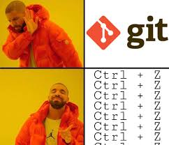

# Explicacion

Los sistemas de control de versiones *VCS* (por sus siglas en inglés)
son herramientas que facilitan hacer un seguimiento sobre cambios
en los archivos. Por ejemplo, cuando se editó un archivo, quién
lo hizo, cuál fue la razón y nos permiten volver a versiones anteriores de
código. Esto sin tener que recurrir a copias innecesarias de archivos tipo 
"*proyecto.txt*", "*proyecto1.txt*", "*proyectofinal.txt*", 
"*proyectofinalestesi.txt*" ...



¿Por qué se considera tan valioso? Cuando se está trabajando solo se guardan
*capturas* del proyecto, guardando una serie de notas de por qué se hicieron 
ciertos cambios, permite trabajar en paralelo en rutas de desarrollo diferentes
y más. Pero son especialmente importantes cuando se trabajan con múltiples 
personas, permitiendo escribir la historia de código entre todos, ver 
sencillamente los cambios de los otros y resolver conflictos cuando dos
usuarios están cambiando las mismas lineas de un archivo.  

Aunque existen múltiples *VCS*, Git es el más usado actualmente. Sin embargo, 
Git es conocido por lo dificl que es aprenderlo, pero sus conceptos más básicos
son hermosos y puede ser fácilmente entendido. Por eso es importante entender
los comandos y no utilizarlos como magia negra. Como revela el siguiente meme.


```bash
git add ...
git commit ...
```